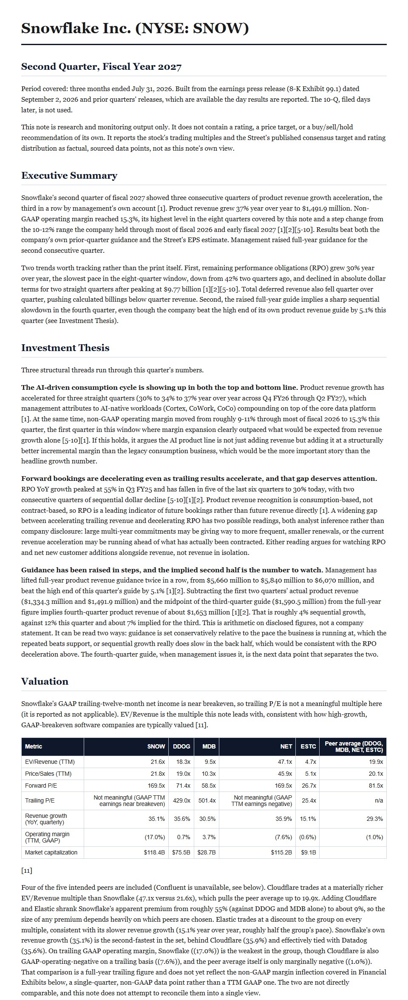

# Agentic Equity Research Analyst

Ticker in, fully cited earnings note out. Built with Claude Code, from public sources only (SEC filings, IR press releases, free APIs). No FactSet or AlphaSense.

I spent time as an equity research analyst, where writing earnings notes meant hours of monotonous work: reconciling GAAP and non-GAAP numbers, checking guidance against last quarter's, and sourcing every claim. This project is a first draft of automating that work.

**See the output:** [samples/SNOW/note.md](samples/SNOW/note.md) is a note on Snowflake's Q2 FY2027 results, with trend charts and a peer valuation table.



## How it works

```
Ticker
  |
  v
1. Retrieval   (plain Python)   SEC EDGAR press release + filings, EPS consensus,
                                transcript (when available), freshness check
  |
  v
2. Extraction  (Claude + Python) Claude reads the release and pulls GAAP and
                                non-GAAP figures, guidance, and whatever KPIs the
                                company itself discloses; Python computes billings
  |
  v
3. Analysis    (Claude + Python) Claude drafts the note; Python fetches 8 quarters
                                of XBRL history and peer multiples, renders charts,
                                saves the file
  |
  v
note.md  (every claim footnoted to a source)
```

The split is deliberate: deterministic code fetches, computes and renders. The model does only the reading comprehension and judgment that regex cannot do across different companies' filings. Steps 2 and 3 run inside a Claude Code session rather than calling a separate metered API, which keeps the project on an existing subscription. The trade-off is that those steps are not a standalone, non-interactive script.

## Design principles

- **Every claim is cited.** The note has numbered footnotes that resolve to a real source document. No source, no claim.
- **Never estimate what isn't disclosed.** Missing data is flagged as a gap, never filled in. The note lists what it could not get (revenue consensus, call transcript, one peer's multiples).
- **Cross-check sources.** In the sample note, Alpha Vantage's EPS for the latest quarter did not match the company's own release. The note flags the mismatch and shows it on the chart instead of silently correcting it.
- **Press-release-led.** Like a real earnings note, it works from the release available the day results are reported. The 10-Q arrives later and is not used.
- **Sector-generic.** KPIs are whatever the company itself discloses (RPO, GMV, DAU, same-store sales, and so on), not a fixed SaaS list.
- **No rating or price target.** The valuation section reports multiples and the Street's published consensus as sourced data, not as the note's own view.

## Testing

75 tests, run with `python -m pytest`. All network calls are mocked, so the suite needs no API keys. The project was built test-first, from written specs in [docs/superpowers/specs](docs/superpowers/specs) and plans in [docs/superpowers/plans](docs/superpowers/plans).

## Known limitations

- Tested end to end on one company (Snowflake). The fiscal-quarter label logic for transcripts is tuned to January fiscal year ends.
- Earnings call transcripts: API Ninjas' free tier does not include them. The free Alpha Vantage fallback works but lags real filers by one to two quarters, so the current quarter's call is usually missing.
- Revenue consensus has no free source and is marked unavailable.
- Alpha Vantage's free tier allows 25 requests per day, which limits how many peers can be fetched in one day.
- Confluent (CFLT) returns no valuation data from Alpha Vantage and is missing from the peer set.

## Setup

```bash
pip install -r requirements-dev.txt
cp .env.example .env
# then fill in .env with your API Ninjas and Alpha Vantage keys
# (SEC EDGAR needs no key, just a real name/email in SEC_USER_AGENT)
```

## Usage (M1: retrieval)

```bash
python -m agents.retrieval_agent --ticker SNOW
```

Run as a module (`-m`), not as a script path. The package uses absolute imports (`from agents.config import ...`), which only resolve when the project root is on `sys.path`, and `-m` is what puts it there.

Saves raw source documents to `data/SNOW/` and prints a freshness report. If API Ninjas' transcript endpoint is gated, it tries Alpha Vantage's transcript endpoint as a fallback.

## Usage (M2: extraction)

M2 is a two-step, Claude-in-the-loop process, because the reading-comprehension work (financials, sector-generic KPI discovery, guidance and language diffing) is done by Claude directly in a session rather than by a script calling an API.

1. **Prep (deterministic, scriptable):**
   ```bash
   python -m agents.extraction_agent --ticker SNOW
   ```
   Requires `data/SNOW/` to already contain M1's output. Fetches and saves the prior quarter's filings into `data/SNOW/` (named with a `_PRIOR_` marker) and prints their paths.

2. **Extraction (Claude-in-the-loop):** ask Claude Code to read the current- and prior-period documents in `data/SNOW/` and produce the structured `current_period`/`prior_period` dicts per the schema in `docs/superpowers/specs/2026-09-04-extraction-agent-m2-design.md`, then call `agents.extraction_agent.save_extracted_result(ticker, base_dir, current_period, prior_period, diffs)` to compute billings and write `data/SNOW/extracted.json`.

## Usage (M3: analysis)

Also Claude-in-the-loop. No CLI command runs the whole thing, because the drafting (thesis, benchmark comparisons, getting every citation right) is the work.

1. **Prerequisite:** `data/SNOW/extracted.json` must exist (run M1 then M2).
2. **Historical data for charts (scriptable):** pull an 8-quarter GAAP trend via `agents.sec_xbrl.get_company_facts()` / `get_quarterly_metric_history()`, and fetch older press releases for non-GAAP margin and RPO trends via `agents.extraction_agent.fetch_historical_press_releases(ticker, count=6)`.
3. **Valuation data (scriptable):** call `agents.alpha_vantage.get_company_overview(ticker, api_key)` for the ticker and each peer. Mind Alpha Vantage's free-tier cap of 25 requests per day.
4. **Draft (Claude-in-the-loop):** ask Claude Code to read `extracted.json`, the Alpha Vantage earnings file, the historical releases and the overview data, and draft the note per the structure in `docs/superpowers/specs/2026-09-07-analysis-agent-m3-design.md` and CLAUDE.md's M3.1 to M3.3 sections: Executive Summary, Investment Thesis, Valuation, Results vs. Benchmarks, Financial Exhibits, New Forward Guidance, Data Limitations, Sources. Risk-factor diffs are deliberately left out of the note (see CLAUDE.md, M3.3).
5. **Charts:** call `agents.analysis_agent.generate_trend_charts(ticker, base_dir, history)` to render revenue, margin, RPO and EPS PNGs under `data/SNOW/charts/`.
6. Call `agents.analysis_agent.save_note(ticker, base_dir, markdown_text)` to write `data/SNOW/note.md`.

## Data sources

- **SEC EDGAR:** 8-K Exhibit 99.1 press releases and XBRL company facts (free, no key)
- **Alpha Vantage:** EPS consensus and surprise, valuation multiples and the Street's published consensus, and a lagging transcript fallback (free tier, 25 requests per day)
- **API Ninjas:** earnings call transcripts. The free tier does not include this endpoint, so the retrieval agent records the error and continues with every other source.
