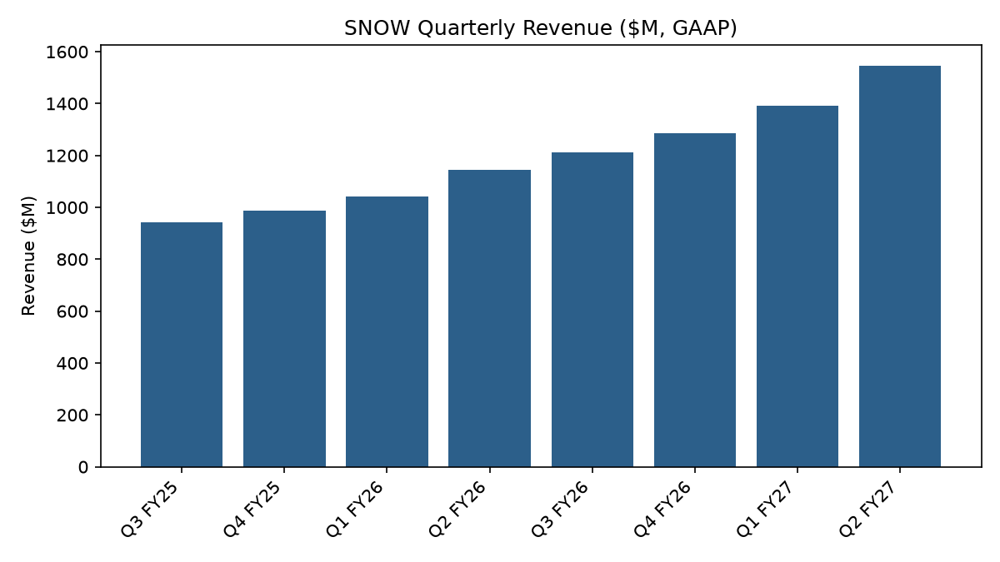
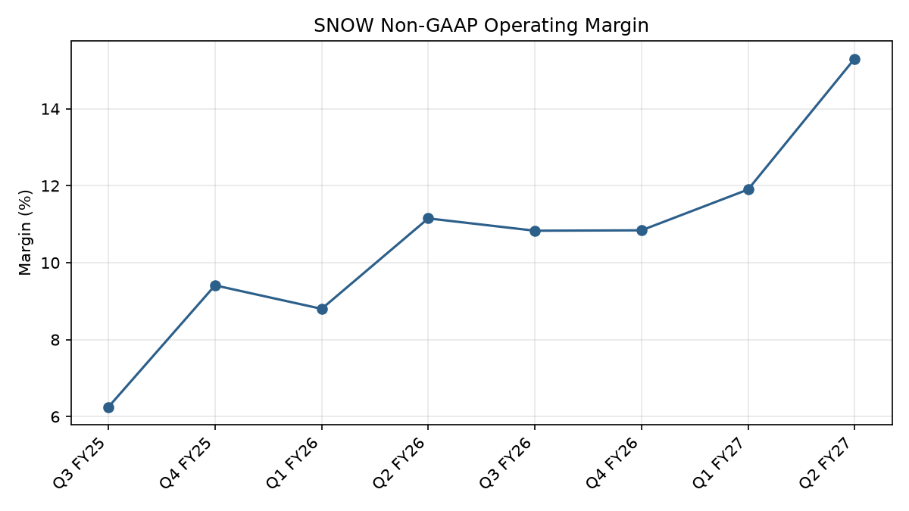
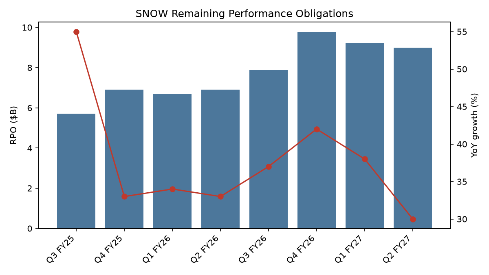
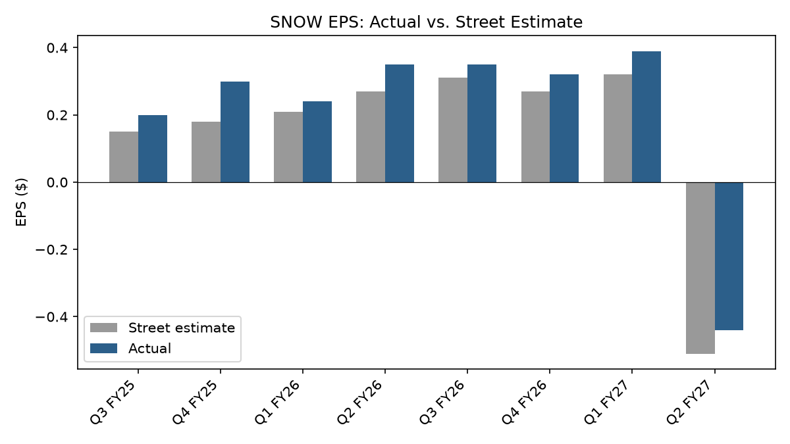

# Snowflake Inc. (NYSE: SNOW)

## Second Quarter, Fiscal Year 2027

Period covered: three months ended July 31, 2026. Built from the earnings press release (8-K Exhibit 99.1) dated September 2, 2026 and prior quarters' releases, which are available the day results are reported. The 10-Q, filed days later, is not used.

This note is research and monitoring output only. It does not contain a rating, a price target, or a buy/sell/hold recommendation of its own. It reports the stock's trading multiples and the Street's published consensus target and rating distribution as factual, sourced data points, not as this note's own view.

## Executive Summary

Snowflake's second quarter of fiscal 2027 showed three consecutive quarters of product revenue growth acceleration, the third in a row by management's own account [1]. Product revenue grew 37% year over year to $1,491.9 million. Non-GAAP operating margin reached 15.3%, its highest level in the eight quarters covered by this note and a step change from the 10-12% range the company held through most of fiscal 2026 and early fiscal 2027 [1][2][5-10]. Results beat both the company's own prior-quarter guidance and the Street's EPS estimate. Management raised full-year guidance for the second consecutive quarter.

Two trends worth tracking rather than the print itself. First, remaining performance obligations (RPO) grew 30% year over year, the slowest pace in the eight-quarter window, down from 42% two quarters ago, and declined in absolute dollar terms for two straight quarters after peaking at $9.77 billion [1][2][5-10]. Total deferred revenue also fell quarter over quarter, pushing calculated billings below quarter revenue. Second, the raised full-year guide implies a sharp sequential slowdown in the fourth quarter, even though the company beat the high end of its own product revenue guide by 5.1% this quarter (see Investment Thesis).

## Investment Thesis

Three structural threads run through this quarter's numbers.

**The AI-driven consumption cycle is showing up in both the top and bottom line.** Product revenue growth has accelerated for three straight quarters (30% to 34% to 37% year over year across Q4 FY26 through Q2 FY27), which management attributes to AI-native workloads (Cortex, CoWork, CoCo) compounding on top of the core data platform [1]. At the same time, non-GAAP operating margin moved from roughly 9-11% through most of fiscal 2026 to 15.3% this quarter, the first quarter in this window where margin expansion clearly outpaced what would be expected from revenue growth alone [5-10][1]. If this holds, it argues the AI product line is not just adding revenue but adding it at a structurally better incremental margin than the legacy consumption business, which would be the more important story than the headline growth number.

**Forward bookings are decelerating even as trailing results accelerate, and that gap deserves attention.** RPO YoY growth peaked at 55% in Q3 FY25 and has fallen in five of the last six quarters to 30% today, with two consecutive quarters of sequential dollar decline [5-10][1][2]. Product revenue recognition is consumption-based, not contract-based, so RPO is a leading indicator of future bookings rather than future revenue directly [1]. A widening gap between accelerating trailing revenue and decelerating RPO has two possible readings, both analyst inference rather than company disclosure: large multi-year commitments may be giving way to more frequent, smaller renewals, or the current revenue acceleration may be running ahead of what has actually been contracted. Either reading argues for watching RPO and net new customer additions alongside revenue, not revenue in isolation.

**Guidance has been raised in steps, and the implied second half is the number to watch.** Management has lifted full-year product revenue guidance twice in a row, from $5,660 million to $5,840 million to $6,070 million, and beat the high end of this quarter's guide by 5.1% [1][2]. Subtracting the first two quarters' actual product revenue ($1,334.3 million and $1,491.9 million) and the midpoint of the third-quarter guide ($1,590.5 million) from the full-year figure implies fourth-quarter product revenue of about $1,653 million [1][2]. That is roughly 4% sequential growth, against 12% this quarter and about 7% implied for the third. This is arithmetic on disclosed figures, not a company statement. It can be read two ways: guidance is set conservatively relative to the pace the business is running at, which the repeated beats support, or sequential growth really does slow in the back half, which would be consistent with the RPO deceleration above. The fourth-quarter guide, when management issues it, is the next data point that separates the two.

## Valuation

Snowflake's GAAP trailing-twelve-month net income is near breakeven, so trailing P/E is not a meaningful multiple here (it is reported as not applicable). EV/Revenue is the multiple this note leads with, consistent with how high-growth, GAAP-breakeven software companies are typically valued [11].

| Metric | SNOW | DDOG | MDB | NET | ESTC | Peer average (DDOG, MDB, NET, ESTC) |
|---|---|---|---|---|---|---|
| EV/Revenue (TTM) | 21.6x | 18.3x | 9.5x | 47.1x | 4.7x | 19.9x |
| Price/Sales (TTM) | 21.8x | 19.0x | 10.3x | 45.9x | 5.1x | 20.1x |
| Forward P/E | 169.5x | 71.4x | 58.5x | 169.5x | 26.7x | 81.5x |
| Trailing P/E | Not meaningful (GAAP TTM earnings near breakeven) | 429.0x | 501.4x | Not meaningful (GAAP TTM earnings negative) | 25.4x | n/a |
| Revenue growth (YoY, quarterly) | 35.1% | 35.6% | 30.5% | 35.9% | 15.1% | 29.3% |
| Operating margin (TTM, GAAP) | (17.0%) | 0.7% | 3.7% | (7.6%) | (0.6%) | (1.0%) |
| Market capitalization | $118.4B | $75.5B | $28.7B | $115.2B | $9.1B | |

[11]

Four of the five intended peers are included (Confluent is unavailable, see below). Cloudflare trades at a materially richer EV/Revenue multiple than Snowflake (47.1x versus 21.6x), which pulls the peer average up to 19.9x. Adding Cloudflare and Elastic shrank Snowflake's apparent premium from roughly 55% (against DDOG and MDB alone) to about 9%, so the size of any premium depends heavily on which peers are chosen. Elastic trades at a discount to the group on every multiple, consistent with its slower revenue growth (15.1% year over year, roughly half the group's pace). Snowflake's own revenue growth (35.1%) is the second-fastest in the set, behind Cloudflare (35.9%) and effectively tied with Datadog (35.6%). On trailing GAAP operating margin, Snowflake ((17.0%)) is the weakest in the group, though Cloudflare is also GAAP-operating-negative on a trailing basis ((7.6%)), and the peer average itself is only marginally negative ((1.0%)). That comparison is a full-year trailing figure and does not yet reflect the non-GAAP margin inflection covered in Financial Exhibits below, a single-quarter, non-GAAP data point rather than a TTM GAAP one. The two are not directly comparable, and this note does not attempt to reconcile them into a single view.

**Data-quality note, not reconciled:** Cloudflare's forward P/E (169.49) matches Snowflake's own (169.49) to two decimal places. This could be a coincidence of consensus forward-EPS estimates and share prices, but given the unrelated EPS-consensus anomaly documented for Snowflake under Results vs. Benchmarks, it is flagged here rather than treated as confirmed. The comparison uses both figures as published.

**Confluent (CFLT) is unavailable.** The data source returned an empty response for it on two separate dates, including once when Cloudflare and Elastic succeeded immediately afterward in the same run. That pattern looks more like a data-coverage gap for this specific ticker than a rate limit, but it is not confirmed.

Separately, and reported as third-party data rather than this note's own view: Wall Street's published consensus on Snowflake is 44 Buy/Strong Buy ratings against 5 Hold and 2 Sell/Strong Sell, with a consensus target price of $413.29. Datadog's distribution is 41 Buy/Strong Buy against 3 Hold and 2 Sell/Strong Sell, target $285.18. MongoDB's is 32 Buy/Strong Buy against 8 Hold and 1 Strong Sell, target $454.72. Cloudflare's is 24 Buy/Strong Buy against 8 Hold and 2 Sell/Strong Sell, target $336.81. Elastic's is 18 Buy/Strong Buy against 12 Hold and 1 Sell, target $110.69 [11].

## Results vs. Benchmarks

### EPS vs. Street

Per Alpha Vantage's earnings-consensus data, Snowflake's most recent quarter shows reported EPS of $(0.44) against a Street estimate of $(0.51), a surprise of +$0.07 (+13.73%) [3].

This figure does not match the company's own release, which discloses GAAP diluted EPS of $(0.55) and non-GAAP diluted EPS of $0.62 for the same quarter [1]. Checking Alpha Vantage's own EPS history against the company's non-GAAP diluted EPS for the seven prior quarters in this note shows an exact or near-exact match every time [3][1][2][5-10]. Only the most recent quarter breaks that pattern, and its reported date (August 26, 2026) predates the actual earnings release (September 2, 2026) by a week. This looks like a data pipeline issue on Alpha Vantage's side specific to the latest quarter, not a genuine discrepancy in what the company reported. The EPS trend chart below uses Alpha Vantage's figures as published, including this anomaly, rather than substituting a corrected number, and the anomaly is visible in the chart as the only quarter where both estimate and actual fall below zero.

Revenue consensus is not available from any free data source and is not estimated here.

### Actual vs. Prior-Quarter Guidance

Management's guidance issued last quarter for this quarter, compared to what was actually reported:

| Metric | Guided | Actual | Result |
|---|---|---|---|
| Product revenue | $1,415M to $1,420M (30% YoY) | $1,491.9M (37% YoY) | Beat the high end by $71.9M (5.1%); YoY growth 7 points above guided |
| Non-GAAP operating margin | 12.5% | 15.3% | Beat by 280 basis points |

[2][1]

### Quarter-over-Quarter and Year-over-Year Trend

Total revenue grew 35% year over year and approximately 11% quarter over quarter, from $1,390.95 million to $1,546.79 million. Product revenue specifically grew 37% year over year and approximately 12% quarter over quarter, from $1,334.33 million to $1,491.86 million [1][2]. See Financial Exhibits below for the full eight-quarter trend.

Total deferred revenue (current plus non-current) fell from $2,877.5 million to $2,596.2 million quarter over quarter [1][2]. Calculated billings, defined as revenue plus the change in total deferred revenue (a standard analyst proxy, not a figure the company reports directly), came to $1,265.6 million, below the quarter's $1,546.8 million in revenue. A decline in deferred revenue following a large Q1 balance is consistent with front-loaded annual renewals earlier in the fiscal year, a seasonal pattern rather than a new development, but that explanation is analyst inference and is flagged as such rather than presented as company disclosure.

## Financial Exhibits

Eight quarters, Q3 FY25 (quarter ended October 31, 2024) through Q2 FY27 (quarter ended July 31, 2026). Revenue, gross profit, operating income, and net income are GAAP figures from SEC XBRL company facts data [4]. Where a fiscal fourth quarter is not separately tagged in XBRL (this filer's 10-K reports only the full fiscal year), the fourth-quarter figure is calculated as the fiscal year total less the sum of the first three quarters, a calculation from two disclosed figures rather than an estimate. This calculated approach was checked against the company's own headline release figures for both historical Q4 periods in this window and matched to within rounding in both cases [5][9].

**Revenue trend**

**Non-GAAP operating margin trend**

**Remaining performance obligations trend**

**EPS: actual vs. Street estimate**

The final quarter shown in this chart (Q2 FY27) reflects the Alpha Vantage data-quality issue described under EPS vs. Street above. The company's own reported non-GAAP diluted EPS for that quarter was $0.62, not the $(0.44) shown.

## New Forward Guidance

For the third quarter of fiscal 2027, management guided product revenue of $1,588 million to $1,593 million (37% to 38% year-over-year growth), non-GAAP operating margin of 15.5%, and non-GAAP diluted share count of 382 million [1].

For the full fiscal year, management raised guidance for the second consecutive quarter: product revenue to $6,070 million (36% year-over-year growth), up from $5,840 million (31%) guided last quarter, which itself had been raised from $5,660 million (27%) the quarter before that. Full-year non-GAAP operating margin guidance rose to 14.5% from 13.5% guided last quarter. Non-GAAP product gross margin guidance was 74.0% and non-GAAP adjusted free cash flow margin guidance was 23.0% [1][2].

The structure and disclaimer language of the guidance section is unchanged from last quarter's release, including the standing statement that a GAAP reconciliation for forward guidance is not provided due to the difficulty of forecasting stock-based compensation [1][2]. Only the guided figures themselves changed, which is the expected pattern quarter to quarter rather than a change in how guidance is framed.

No verbal guidance commentary from the earnings call is reflected in this note. The call transcript was not accessible this quarter (see Data Limitations below).

## Data Limitations

- Revenue consensus is unavailable from any free data source and is not estimated in this note.
- The earnings call transcript was unavailable this quarter. The transcript data provider's free tier does not include the endpoint used by this project's retrieval agent, and the free fallback source lags real filers by one to two quarters. No verbal guidance additions or management Q&A commentary are reflected anywhere in this note as a result.
- The EPS consensus data quality issue described under EPS vs. Street above affects only the trend chart's final data point and the Street-comparison figures for the most recent quarter. It does not affect any GAAP or non-GAAP figures sourced directly from the company's own releases.
- Peer valuation multiples come from a single third-party source and could not be cross-checked against a second one. Confluent is missing from the peer set (see Valuation).

## Sources

[1] Snowflake Inc., Form 8-K Exhibit 99.1, "Snowflake Reports Financial Results for the Second Quarter of Fiscal 2027," dated September 2, 2026 (accession 0001640147-26-000033).

[2] Snowflake Inc., Form 8-K Exhibit 99.1, "Snowflake Reports Financial Results for the First Quarter of Fiscal 2027," dated May 27, 2026 (accession 0001640147-26-000019).

[3] Alpha Vantage EARNINGS endpoint data for SNOW. See the data-quality note under EPS vs. Street.

[4] SEC EDGAR XBRL company facts for CIK 0001640147 (`https://data.sec.gov/api/xbrl/companyfacts/CIK0001640147.json`), used for the eight-quarter GAAP revenue, gross profit, operating income, and net income series in Financial Exhibits.

[5] Snowflake Inc., Form 8-K Exhibit 99.1, "Snowflake Reports Financial Results for the Fourth Quarter and Full-Year of Fiscal 2026," dated February 25, 2026.

[6] Snowflake Inc., Form 8-K Exhibit 99.1, "Snowflake Reports Financial Results for the Third Quarter of Fiscal 2026," dated December 3, 2025.

[7] Snowflake Inc., Form 8-K Exhibit 99.1, "Snowflake Reports Financial Results for the Second Quarter of Fiscal 2026," dated August 27, 2025.

[8] Snowflake Inc., Form 8-K Exhibit 99.1, "Snowflake Reports Financial Results for the First Quarter of Fiscal 2026," dated May 21, 2025.

[9] Snowflake Inc., Form 8-K Exhibit 99.1, "Snowflake Reports Financial Results for the Fourth Quarter and Full-Year of Fiscal 2025," dated February 26, 2025.

[10] Snowflake Inc., Form 8-K Exhibit 99.1, "Snowflake Reports Financial Results for the Third Quarter of Fiscal 2025," dated November 20, 2024.

[11] Alpha Vantage OVERVIEW endpoint data for SNOW, DDOG, and MDB, fetched September 9, 2026, and for NET and ESTC, fetched September 19, 2026. CFLT was part of the intended peer set but returned an empty response on both dates; see Valuation above.
